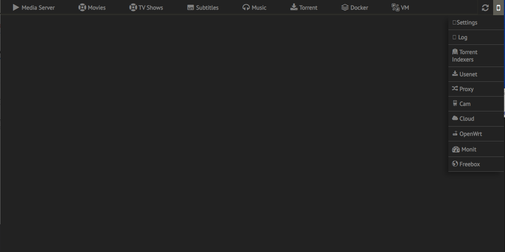
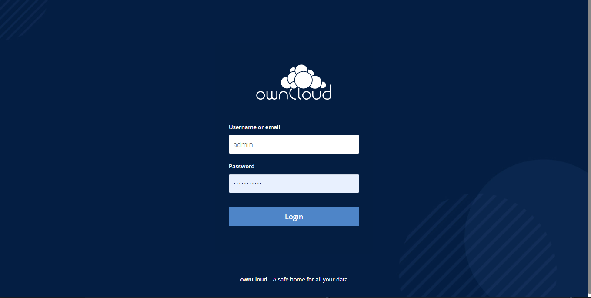

# HTPC media Dockerized Applications based on Ubuntu - docker-compose w/ watchtower, traefik, portainer, glances, vbox-http, certs-extraction, muximux, nzbget, jackett, qbittorrent, bazarr, radarr, sonarr, lidarr, emby, owncloud, redis, onlyoffice, motioneye, iperf3

## Requirements
* Ubuntu 18.04 LTS or more
* `Add hostname` or static lease on your router `to target HTPC IP address` (and the `Local domain: local`) (for local reverse-proxy setup):

Example with HTPC IP address: 192.128.1.10

| local hostname | local ip | local port | web port :key: |
| --- | --- | --- | --- |
|  **media.htpc.local** | **192.128.1.10** | 80 | --- |
|  monit.htpc.local | 192.128.1.10 | 80 | --- |
|  proxy.htpc.local | 192.128.1.10 | 80 | 443 |
|  docker.htpc.local | 192.128.1.10 | 80 | --- |
|  vm.htpc.local | 192.128.1.10 | 80 | --- |
|  nzbget.htpc.local | 192.128.1.10 | 80 | --- |
|  jackett.htpc.local | 192.128.1.10 | 80 | --- |
|  qbittorrent.htpc.local | 192.128.1.10 | 80 | --- |
|  bazarr.htpc.local | 192.128.1.10 | 80 | --- |
|  radarr.htpc.local | 192.128.1.10 | 80 | --- |
|  sonarr.htpc.local | 192.128.1.10 | 80 | --- |
|  lidarr.htpc.local | 192.128.1.10 | 80 | --- |
|  **emby.htpc.local** | **192.128.1.17** | 8096 | 8920 |
|  **htpc.local/owncloud** | 192.128.1.10 | 80 | 443 |
|  **onlyoffice.htpc.local** | 192.128.1.10 | 8095 | 8095 |
|  cam.htpc.local | 192.128.1.10 | 80 | --- |

* On your main router, `open firewall tcp ports` 80, 443 forward to target your HTPC IP address

## Install steps
1. Build and run docker applications

Setup is located on docker-htpc/`.env`
* `DOMAIN`: sub.example.com the domain name dns resolution

```bash
$ echo "htpc" > /etc/hostname
$ git clone https://github.com/joweisberg/docker-htpc.git
$ cd $HOME/docker-htpc && ./docker-build.sh
```

2. HTPC web access:

* http://media.htpc.local/ - HTPC console management

* https://sub.example.com/owncloud (default login/password: admin/owncloud)

